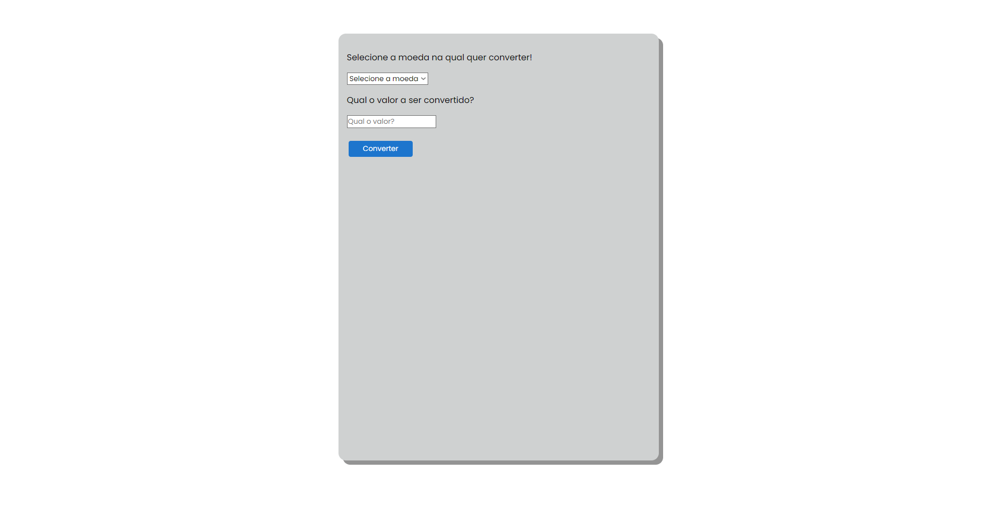
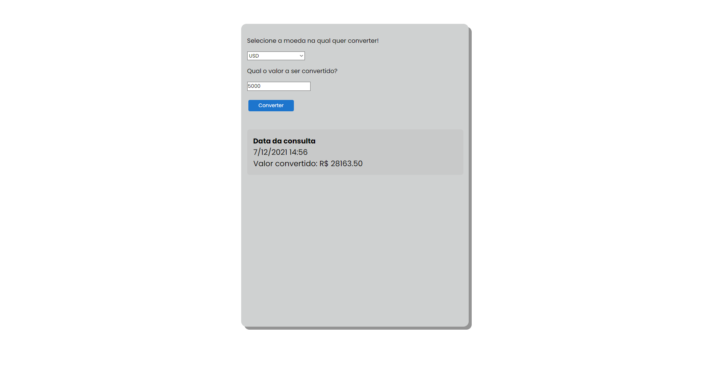

  <h1 align="center">Conversor Moedas</h1>

<!-- Getting Started -->
## INICIANDO O PROJETO

Para instalar o projeto em sua maquina siga os passos abaixo.

### INSTALAÇÃO

1. Clone o repositório

   ```sh
   git clone https://github.com/NiloMarcos/ConversorMoedas.git
   ```

2. Entre na pasta

   ```sh
   cd ConversorMoedas
   ```

3. Instale as dependências

   ```sh
   yarn
   ```

   ou

   ```sh
   npm i

### Fotos da aplicação

<p align="center">
<table  style="border: none">
  <tr>
    <td>
      
    </td>
    <td>
      
    </td>
  </tr>
</table>
</p>